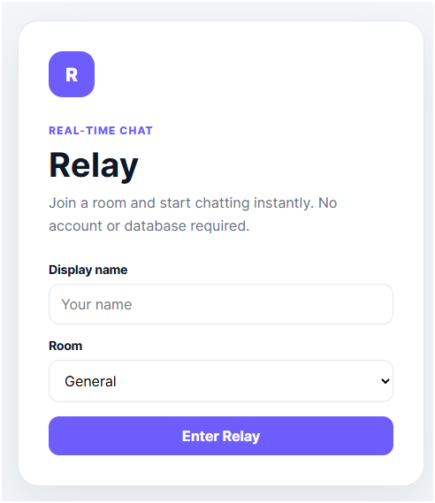
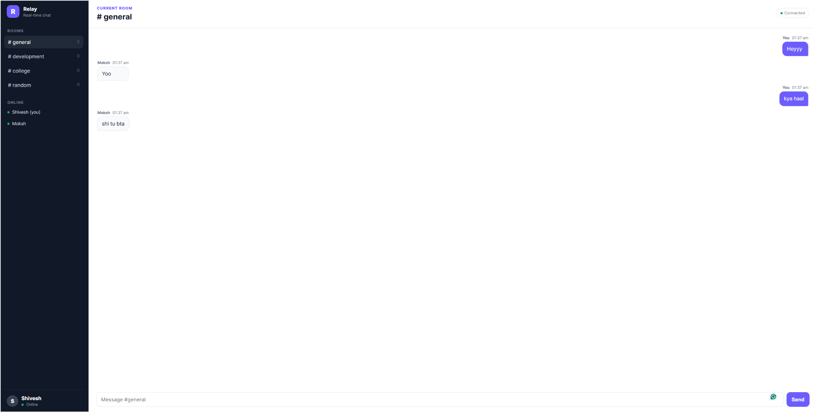
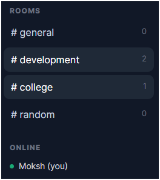
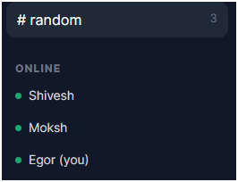
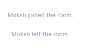

# Relay — Real-Time Chat

Relay is a multi-room real-time chat application built with **Node.js, Express, Socket.IO, HTML, CSS, and vanilla JavaScript**.

It demonstrates real-time messaging, room-based communication, online presence, join/leave events, and live user counts using a simple client-server architecture.

---

## Project Preview

### Join Screen



### Real-Time Chat



### Rooms & User Counts



### Online Users



### Presence Events



---

## Features

- Real-time messaging
- Multiple chat rooms
- Online user list
- Room user counts
- Join / leave presence messages
- Typing indicator support
- In-memory message history
- Responsive desktop/mobile interface
- Enter to send
- Shift + Enter for newline
- Automatic textarea resizing
- Live connection status

---

## Tech Stack

| Technology | Usage |
| --- | --- |
| Node.js | Server runtime |
| Express | Static file server |
| Socket.IO | Real-time client-server communication |
| HTML5 | UI structure |
| CSS3 | Responsive interface |
| JavaScript | Client and server logic |

---

## How It Works

Relay follows a simple real-time client-server flow:

```text
Browser
   ↓
Socket.IO Client
   ↓
Node.js + Express
   ↓
Socket.IO Server
   ↓
Chat Room
   ↓
Connected Users
```
---

## When a user sends a message:

```text
User types message
        ↓
app.js
        ↓
socket.emit("send-message")
        ↓
server.js receives event
        ↓
message is created
        ↓
io.to(room).emit("message")
        ↓
users in that room receive it

```

## Rooms

Relay currently includes four rooms:

``` text
# general
# development
# college
# random

```
## Message History

Messages are currently stored in server memory.

const rooms = {
  general: [],
  development: [],
  college: [],
  random: []
};

--- 

## Project Structure 

``` text

relay-realtime-chat/
├── public/
│   ├── index.html
│   ├── style.css
│   └── app.js
│
├── screenshot/
│   ├── relay-login.png
│   ├── relay-chat.png
│   ├── relay-rooms.png
│   ├── relay-online-users.png
│   └── relay-presence-events.png
│
├── .gitignore
├── README.md
├── package.json
└── server.js

```
--- 

## Concepts Used

This project demonstrates:

Node.js
Express
Socket.IO
WebSockets
Event-driven architecture
Client-server communication
Real-time events
Broadcasting
Rooms
User presence
JavaScript Maps
DOM manipulation
Event listeners
Server-side state
Responsive CSS
Mobile layouts

---

## Future Improvements

Possible upgrades include:

User authentication
MongoDB or PostgreSQL
Persistent message history
Private messaging
Read receipts
File uploads
Message reactions
User avatars
Moderation controls
Redis-based scaling
Better mobile UI
Deployment with persistent storage

